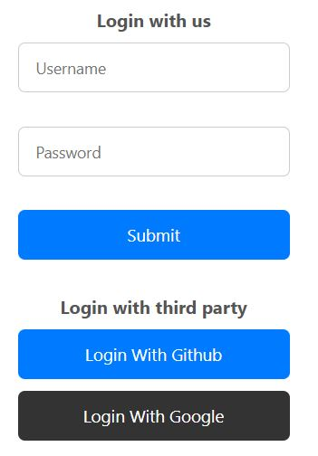

# 🍃 Springboot Oauth & Jwt Authentication
This project is a rough sketch of how to setup oauth and jwt logic with Springboot for securing endpoints serverside.

Includes a frontend react component just for holistic view of Oauth flow, but the signup and login logic remains for serverside testing only so just manually ping the endpoints.

10/10 learning experience, would not do it again, felt very tedious, java docs in general were hard to navigate, let alone make sense of.

## Core features
- UI components with protected /Home route on clientside.
- Oauth and Jwt based login on serverside with route protection made easy due to the power of Spring security configs.

### Whaddida miss?
- Full projects need roles configured for users. This project assigns users as simply user authority in spring security's context, when usually one would assign multiple roles depending on the user, that however, is out of scope, just some beans for thought BEAAAANS.